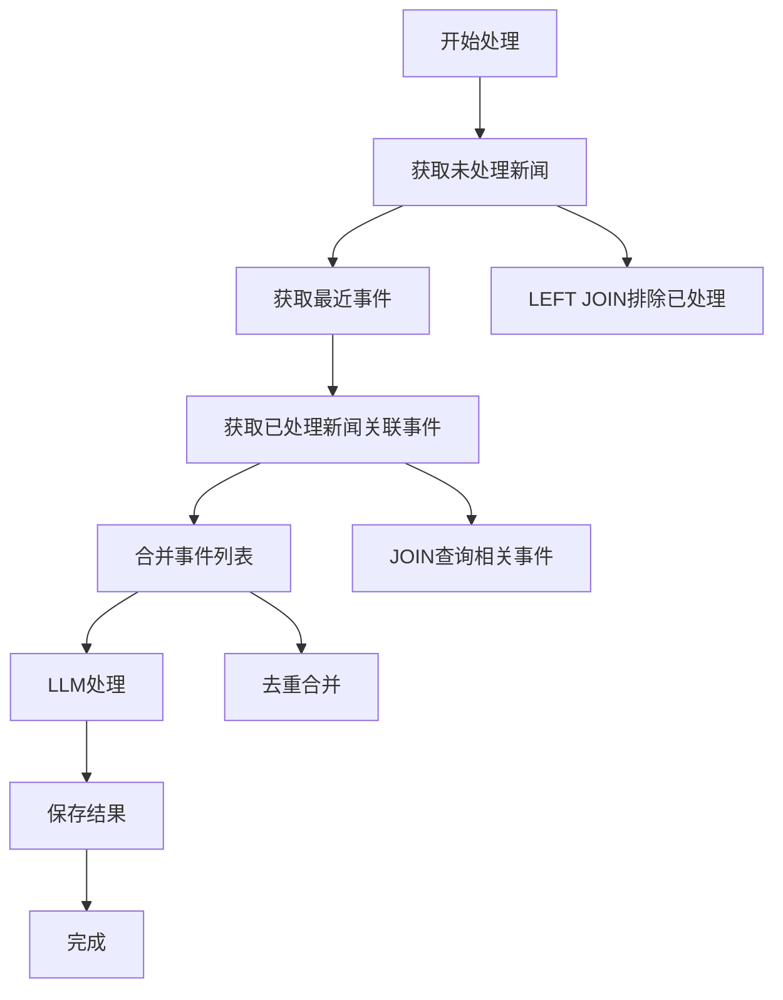

# 重复处理问题修复文档

## 问题描述

在事件聚合处理过程中，发现已经处理过的新闻会被重复处理，导致以下问题：

1. **数据库唯一约束冲突**：尝试插入重复的新闻-事件关联记录
2. **资源浪费**：重复调用LLM处理已处理的新闻
3. **效率低下**：处理时间增加，成本上升

### 错误示例
```
IntegrityError: (1062, "Duplicate entry '402785-11' for key 'uk_news_event'")
```

## 解决方案

### 1. 修改新闻查询逻辑

**修改前**：直接查询时间范围内的所有新闻
```sql
SELECT * FROM hot_news_base 
WHERE first_add_time >= ? AND first_add_time <= ? 
AND type IN (?)
```

**修改后**：排除已处理的新闻
```sql
SELECT hnb.* 
FROM hot_news_base hnb 
LEFT JOIN hot_aggr_news_event_relations haner ON hnb.id = haner.news_id 
WHERE haner.news_id IS NULL 
AND hnb.first_add_time >= ? AND hnb.first_add_time <= ?
AND hnb.type IN (?)
```

### 2. 获取已处理新闻关联的事件

新增方法 `_get_events_from_processed_news`，获取时间范围内已处理新闻关联的事件：

```sql
SELECT DISTINCT hae.* 
FROM hot_aggr_events hae
JOIN hot_aggr_news_event_relations haner ON hae.id = haner.event_id
JOIN hot_news_base hnb ON haner.news_id = hnb.id
WHERE hnb.first_add_time >= ? AND hnb.first_add_time <= ?
AND hnb.type IN (?)
```

### 3. 合并事件列表

将最近事件和已处理新闻关联的事件合并，提供给LLM：

```python
# 合并事件列表，避免重复
all_events = recent_events.copy()
existing_event_ids = {event['id'] for event in recent_events}

for event in processed_news_events:
    if event['id'] not in existing_event_ids:
        all_events.append(event)
        existing_event_ids.add(event['id'])
```

## 修改的文件

### `services/event_aggregation_service.py`

1. **修改 `_get_news_to_process` 方法**
   - 使用 `LEFT JOIN` 排除已处理新闻
   - 添加日志记录未处理新闻数量

2. **新增 `_get_events_from_processed_news` 方法**
   - 查询已处理新闻关联的事件
   - 支持时间范围和类型过滤
   - 返回标准化的事件字典格式

3. **修改 `run_aggregation_process` 方法**
   - 调用新方法获取已处理新闻事件
   - 合并事件列表
   - 使用合并后的事件列表调用LLM

## 处理流程



## 效果验证

### 1. 避免重复处理
- ✅ 已处理新闻不会被重复查询
- ✅ 不会出现数据库唯一约束冲突
- ✅ 减少不必要的LLM调用

### 2. 保持上下文完整性
- ✅ LLM能看到相关的历史事件
- ✅ 基于完整信息进行聚合决策
- ✅ 提高聚合准确性

### 3. 提高处理效率
- ✅ 减少数据库查询量
- ✅ 降低LLM处理成本
- ✅ 提升整体处理速度

## 测试验证

运行测试脚本验证修复效果：

```bash
cd test_scripts
python test_duplicate_processing_fix.py
```

## 注意事项

1. **数据库性能**：LEFT JOIN 可能影响查询性能，建议在相关字段上建立索引
2. **事件去重**：合并事件列表时需要去重，避免重复事件
3. **日志记录**：增加详细日志，便于问题排查和性能监控

## 相关配置

无需修改配置文件，修改仅涉及代码逻辑。

## 版本信息

- 修复日期：2025-09-25
- 影响版本：所有版本
- 修复类型：Bug修复 + 性能优化